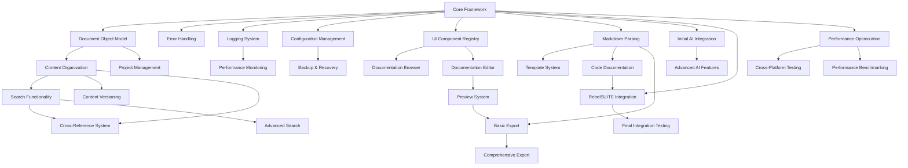

# RebelSCRIBE Completion Roadmap

## Final Goal Definition

RebelSCRIBE is an AI-powered documentation and content management system for the RebelSUITE ecosystem. Its final goal is to provide comprehensive documentation generation, content management, AI-assisted content creation, and seamless integration with all RebelSUITE components.

### Key Capabilities at Completion

- Automated documentation generation from source code
- AI-powered content summarization and quality analysis
- Hierarchical content organization with advanced search
- Export to multiple formats (PDF, HTML, DOCX, Markdown)
- Integration with all RebelSUITE components
- Cross-platform support (Windows, macOS, Linux)
- GPU-accelerated AI operations

## Current Status Assessment

RebelSCRIBE is in the early stages of development, with focus on establishing the core framework and fundamental components. The current overall completion is approximately 7.75%.

### Progress by Category

| Category | Current Completion | Status |
|----------|-------------------|--------|
| Core Framework | 15% | In Progress |
| Documentation Generation | 10% | In Progress |
| Content Management | 5% | In Progress |
| AI Integration | 5% | In Progress |
| RebelSUITE Integration | 0% | Not Started |
| User Interface | 10% | In Progress |
| Export & Publishing | 0% | Not Started |
| Performance & Stability | 5% | In Progress |
| Testing & QA | 10% | In Progress |
| Platform Support | 5% | In Progress |

### Key Achievements to Date

1. UI component registry completed (100%)
2. Basic testing infrastructure established
3. Initial configuration management system implemented
4. Core framework partially implemented
5. Basic error handling framework in place

### Current Challenges

1. Complexity of AI integration with documentation generation
2. Resource allocation for parallel development tracks
3. Defining clear APIs for RebelSUITE integration
4. Balancing feature development with technical foundation work

## Detailed Completion Roadmap

The development of RebelSCRIBE is organized into four major phases, each with specific milestones and deliverables:

### Phase 1: Foundation (Current Phase - 25% Complete)

**Objective**: Establish the core framework and basic functionality

**Timeline**: Q1 2025 - Q2 2025 (6 months)

**Key Deliverables**:

| Deliverable | Status | Target Completion | Dependencies |
|-------------|--------|-------------------|--------------|
| Core framework implementation | In Progress (30%) | Week 12 | None |
| Document object model | In Progress (25%) | Week 14 | Core framework |
| Error handling framework | In Progress (40%) | Week 10 | Core framework |
| Logging system | In Progress (50%) | Week 8 | Core framework |
| Configuration management | In Progress (35%) | Week 11 | Core framework |
| UI component registry | Complete (100%) | Week 6 | None |
| Basic testing infrastructure | In Progress (30%) | Week 16 | Core framework |
| Project management system | In Progress (30%) | Week 18 | Document object model |
| Backup and recovery system | Not Started (0%) | Week 20 | Core framework, Configuration management |
| Performance monitoring foundation | Not Started (0%) | Week 22 | Core framework, Logging system |

**Milestones**:
- M1.1: Core Framework Alpha (Week 12)
- M1.2: Basic UI Components Complete (Week 16)
- M1.3: Testing Infrastructure Established (Week 20)
- M1.4: Phase 1 Complete / Alpha Release Readiness (Week 24)

**Current Focus**:
- Complete core framework implementation
- Finalize document object model
- Enhance error handling and logging
- Expand testing infrastructure

### Phase 2: Core Functionality (0% Complete)

**Objective**: Implement essential documentation and content management features

**Timeline**: Q2 2025 - Q3 2025 (6 months)

**Key Deliverables**:

| Deliverable | Status | Target Completion | Dependencies |
|-------------|--------|-------------------|--------------|
| Markdown parsing and rendering | In Progress (20%) | Week 28 | Core framework |
| Content organization system | In Progress (15%) | Week 30 | Document object model |
| Documentation editor | Not Started (0%) | Week 32 | UI component registry |
| Preview system | Not Started (0%) | Week 34 | Documentation editor |
| Basic search functionality | Not Started (0%) | Week 36 | Content organization system |
| Initial AI integration | In Progress (10%) | Week 38 | Core framework |
| Code documentation extraction | Not Started (0%) | Week 40 | Markdown parsing |
| Template system | In Progress (15%) | Week 42 | Markdown parsing |
| Basic export capabilities | Not Started (0%) | Week 44 | Markdown parsing, Preview system |
| Documentation browser UI | In Progress (15%) | Week 46 | UI component registry |

**Milestones**:
- M2.1: Documentation Editor Complete (Week 32)
- M2.2: Basic Search Functionality (Week 36)
- M2.3: Initial AI Integration (Week 40)
- M2.4: Phase 2 Complete / Beta Release Readiness (Week 48)

**Planned Focus**:
- Complete markdown parsing and rendering
- Develop content organization system
- Implement documentation editor and preview
- Establish basic search functionality
- Integrate initial AI capabilities

### Phase 3: Advanced Features & Integration (0% Complete)

**Objective**: Implement advanced features and RebelSUITE integration

**Timeline**: Q3 2025 - Q4 2025 (6 months)

**Key Deliverables**:

| Deliverable | Status | Target Completion | Dependencies |
|-------------|--------|-------------------|--------------|
| Advanced AI features | Not Started (0%) | Week 52 | Initial AI integration |
| Cross-reference system | Not Started (0%) | Week 54 | Content organization, Search functionality |
| Content versioning | Not Started (0%) | Week 56 | Content organization system |
| RebelCAD integration | Not Started (0%) | Week 58 | Core framework, Documentation generation |
| RebelCODE integration | Not Started (0%) | Week 60 | Core framework, Documentation generation |
| RebelENGINE integration | Not Started (0%) | Week 62 | Core framework, Documentation generation |
| RebelFLOW integration | Not Started (0%) | Week 64 | Core framework, Documentation generation |
| RebelDESK integration | Not Started (0%) | Week 66 | Core framework, Documentation generation |
| Advanced search capabilities | Not Started (0%) | Week 68 | Basic search functionality |
| Comprehensive export options | Not Started (0%) | Week 70 | Basic export capabilities |

**Milestones**:
- M3.1: Advanced AI Features Complete (Week 54)
- M3.2: Initial RebelSUITE Integration (Week 62)
- M3.3: Advanced Search & Export (Week 68)
- M3.4: Phase 3 Complete / Release Candidate Readiness (Week 72)

**Planned Focus**:
- Implement advanced AI-powered features
- Develop cross-reference and versioning systems
- Integrate with all RebelSUITE components
- Enhance search capabilities
- Expand export and publishing options

### Phase 4: Refinement & Release (0% Complete)

**Objective**: Finalize all features, optimize performance, and prepare for release

**Timeline**: Q4 2025 - Q1 2026 (6 months)

**Key Deliverables**:

| Deliverable | Status | Target Completion | Dependencies |
|-------------|--------|-------------------|--------------|
| Performance optimization | Not Started (0%) | Week 76 | All core features |
| Cross-platform testing | Not Started (0%) | Week 78 | All core features |
| Security enhancements | Not Started (0%) | Week 80 | All core features |
| Documentation completion | Not Started (0%) | Week 82 | All features |
| User acceptance testing | Not Started (0%) | Week 84 | All features |
| Bug fixing and refinement | Not Started (0%) | Week 86 | User acceptance testing |
| Final integration testing | Not Started (0%) | Week 88 | All integrations |
| Performance benchmarking | Not Started (0%) | Week 90 | Performance optimization |
| Release preparation | Not Started (0%) | Week 92 | All deliverables |
| Final release | Not Started (0%) | Week 96 | Release preparation |

**Milestones**:
- M4.1: Performance Optimization Complete (Week 78)
- M4.2: Documentation & Testing Complete (Week 84)
- M4.3: Final Integration & Refinement (Week 90)
- M4.4: Final Release (Week 96)

**Planned Focus**:
- Optimize performance and stability
- Complete cross-platform testing
- Finalize documentation
- Conduct user acceptance testing
- Prepare for final release

## Implementation Priority List

The following priorities guide the implementation sequence:

### Critical Path Items

1. Core framework implementation
2. Document object model
3. Markdown parsing and rendering
4. Content organization system
5. Search functionality
6. AI integration
7. RebelSUITE component integration
8. Export and publishing
9. Performance optimization
10. Cross-platform support

### Dependencies

## Technical Debt & Refactoring Needs

| Area | Technical Debt | Priority | Impact | Planned Resolution |
|------|---------------|----------|--------|-------------------|
| Core Framework | Early design decisions may limit scalability | Medium | Could impact performance with large documentation sets | Phase 2: Refactor core classes for better scalability |
| UI Components | Component coupling too tight in some areas | Medium | Makes testing and maintenance more difficult | Phase 2: Refactor to improve separation of concerns |
| Error Handling | Inconsistent error handling patterns | High | Affects stability and debugging | Phase 1: Standardize error handling approach |
| Configuration | Hard-coded values in some components | Medium | Limits flexibility and testing | Phase 1: Move all configuration to external system |
| Testing | Test coverage gaps in core functionality | High | Risk of regressions | Phase 1-2: Increase test coverage to >80% |
| Documentation | Incomplete internal documentation | Medium | Knowledge transfer issues | Ongoing: Improve documentation with each feature |

## Integration Testing Plan

### RebelCAD Integration

- **Testing Focus**: Model documentation generation, CAD-specific templates
- **Test Cases**: 
  1. Generate documentation from CAD models
  2. Create constraint documentation
  3. Document assembly relationships
  4. Generate technical drawings documentation
- **Timeline**: Phase 3, Weeks 58-60

### RebelCODE Integration

- **Testing Focus**: API documentation, code examples, syntax highlighting
- **Test Cases**:
  1. Generate API documentation from code
  2. Document code examples with syntax highlighting
  3. Create interactive code documentation
  4. Link documentation to source code
- **Timeline**: Phase 3, Weeks 60-62

### RebelENGINE Integration

- **Testing Focus**: Asset documentation, shader documentation, scene documentation
- **Test Cases**:
  1. Generate asset documentation
  2. Document shader parameters
  3. Create scene hierarchy documentation
  4. Document animation systems
- **Timeline**: Phase 3, Weeks 62-64

### RebelFLOW Integration

- **Testing Focus**: Workflow documentation, node documentation, script documentation
- **Test Cases**:
  1. Generate workflow documentation
  2. Document node connections and parameters
  3. Create script documentation
  4. Document automation processes
- **Timeline**: Phase 3, Weeks 64-66

### RebelDESK Integration

- **Testing Focus**: Plugin documentation, IDE integration, help system
- **Test Cases**:
  1. Generate plugin documentation
  2. Integrate with IDE help system
  3. Create context-sensitive documentation
  4. Document IDE features
- **Timeline**: Phase 3, Weeks 66-68

### Cross-Component Integration

- **Testing Focus**: Unified search, cross-linking, consistent styling
- **Test Cases**:
  1. Search across all component documentation
  2. Follow cross-component links
  3. Verify consistent styling and formatting
  4. Test unified authentication
- **Timeline**: Phase 3-4, Weeks 68-72

## Release Criteria

### Alpha Release (30% Completion)

- Core Framework: 60% complete
- Documentation Generation: 40% complete
- Content Management: 30% complete
- AI Integration: 30% complete
- User Interface: 50% complete
- Testing & QA: 40% complete
- All critical bugs fixed
- Basic functionality working end-to-end

### Beta Release (60% Completion)

- Core Framework: 80% complete
- Documentation Generation: 70% complete
- Content Management: 70% complete
- AI Integration: 60% complete
- RebelSUITE Integration: 50% complete
- User Interface: 80% complete
- Export & Publishing: 60% complete
- Performance & Stability: 60% complete
- Testing & QA: 70% complete
- Platform Support: 60% complete
- No critical bugs
- Performance meeting 80% of targets

### Release Candidate (90% Completion)

- All categories at minimum 80% complete
- Critical features 100% complete
- No known critical bugs
- Performance metrics meeting targets
- All planned integrations functional
- Documentation 90% complete
- All tests passing

### Final Release (100% Completion)

- All planned features implemented
- All tests passing
- Documentation complete
- Performance targets met
- All integrations thoroughly tested
- User acceptance testing complete
- No known bugs of medium or higher severity

## Performance Metrics

| Metric | Target | Current | Status |
|--------|--------|---------|--------|
| Documentation generation time | < 5s small, < 30s large | Not measured | Not started |
| Search response time | < 500ms | Not measured | Not started |
| UI responsiveness | < 100ms | Not measured | Not started |
| Memory usage | < 500MB | Not measured | Not started |
| Export speed | < 10s typical | Not measured | Not started |
| AI response time | < 2s | Not measured | Not started |
| Startup time | < 3s | Not measured | Not started |
| Cross-reference resolution | < 100ms | Not measured | Not started |

## Next Steps

1. **Complete Core Framework (Next 4 Weeks)**
   - Finalize document object model
   - Complete error handling framework
   - Finish configuration management system
   - Implement remaining logging features

2. **Advance UI Development (Next 6 Weeks)**
   - Complete documentation browser implementation
   - Begin content editor development
   - Design preview system
   - Implement theme support framework

3. **Enhance Documentation Generation (Next 8 Weeks)**
   - Complete markdown parsing and rendering
   - Begin code documentation extraction implementation
   - Develop template system
   - Start cross-reference system design

4. **Improve Testing Infrastructure (Next 10 Weeks)**
   - Increase unit test coverage
   - Implement integration tests for core components
   - Develop UI testing framework
   - Begin performance testing design

5. **Begin AI Integration (Next 12 Weeks)**
   - Implement content summarization
   - Develop documentation quality analysis
   - Design AI-assisted content creation
   - Enhance GPU acceleration support

---

*Last Updated: 2025-03-19*
*Note: This is a living document that should be updated as development progresses.*
